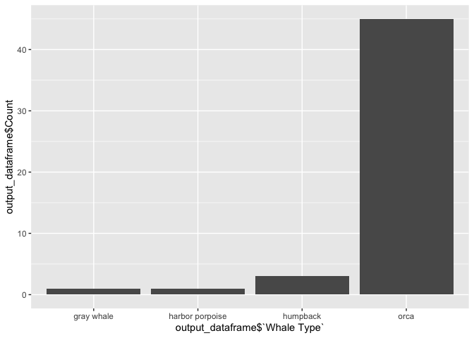

<!-- README.md is generated from README.Rmd. Please edit that file -->

# whalesighting

<!-- badges: start -->

<!-- badges: end -->

*The Whale Hotline API* is created and maintained by [The Whale
Museum](https://whalemuseum.org). Based in Washington, the museum is
dedicated to promote stewardship of whales and the Salish Sea ecosystem
through education and research. One of its daily functions is to run
**The Whale Hotline**. Over the past 30 years, they’ve been collecting
whales sighting data around the world. Through [The Whale Hotline
API](http://hotline.whalemuseum.org/api), users can access numerous
interesting whales data, and researchers can extract valuable
information and observe crucial trends.

The purpose of this project is to build a API client in the form of a R
package. By installing this `whalesighting` package, users can access
this database in R environment and get different kinds of whale-related
information utilizing a variety of functions.

## Installation

You can install the released version of whalesighting from github with:

``` r
# devtools::install_github('Maxixixi/whalesighting')
library(whalesighting)
#> Loading required package: httr
#> Loading required package: rvest
#> Loading required package: xml2
#> Loading required package: stringr
#> Loading required package: dplyr
#> 
#> Attaching package: 'dplyr'
#> The following objects are masked from 'package:stats':
#> 
#>     filter, lag
#> The following objects are masked from 'package:base':
#> 
#>     intersect, setdiff, setequal, union
#> Loading required package: ggplot2
```

## Example

Here are several examples which show you how to interact with this
package’s 5 functions

#### Function 1: `whale_info()`

``` r
whale_info(10)
#>            species         latitude         longitude
#> 1             orca         47.79953       -122.479967
#> 2  harbor porpoise  48.047447813103 -122.404775973145
#> 3         humpback 47.3072885076999  -122.56167447168
#> 4         humpback 47.1669597813916 -122.614546175781
#> 5         humpback 47.8845786851079 -122.342119570557
#> 6             orca 48.4584089960052 -123.041210528198
#> 7       gray whale 48.2407954536282 -122.942762728516
#> 8             orca        49.650783       -124.862267
#> 9             orca            47.78           -122.44
#> 10            orca            47.62           -122.45
#>                     location           sighted_at
#> 1                            2017-11-09T18:11:00Z
#> 2      Camano Island, WA, US 2017-10-01T00:38:00Z
#> 3         Gig Harbor, WA, US 2017-09-03T00:45:00Z
#> 4         Steilacoom, WA, US 2017-07-29T21:55:00Z
#> 5            Edmonds, WA, US 2017-07-16T02:39:00Z
#> 6      Friday Harbor, WA, US 2017-06-25T14:02:00Z
#> 7         Coupeville, WA, US 2017-06-14T13:30:00Z
#> 8                            2016-11-28T20:30:00Z
#> 9           Kingston, WA, US 2016-11-14T20:28:00Z
#> 10 Bainbridge Island, WA, US 2016-11-14T18:09:00Z
```

#### Function 2: `whaletype_freq()`

``` r
whaletype_freq(50)
```



#### Function 3: `whale_des()`

``` r
whale_des(50)
#>        Whale Type
#> 1            orca
#> 2 harbor porpoise
#> 3        humpback
#> 4      gray whale
#>                                                                                                                                                                                                                                                                                                                                                                                                                                                                                                                                                                                                                                                Description
#> 1                                                                                                                                                                                                                                                                                                                                                                 With their beautiful black-and-white coloration, orcas, also called killer whales, have an unmistakable appearance. They are toothed whales that gather in family-oriented pods of 10 to 50. They are popular animals for marine parks, a practice that is growing more controversial.\n
#> 2                                                                                                                                                                                                                                                                                                                                                                                                                                                                                                                                                                                                                                                     <NA>
#> 3 The humpback whale is known as the "big-winged New Englander" because it has long pectoral fins or flippers, and the first humpback scientifically described was in New England waters. Its majestic tail and variety of spectacular behaviors make this whale a favorite of whale watchers. Humpbacks are a medium-size baleen whale with a thick blubber layer, making them clumsier in appearance than some of their more streamlined relatives. They are well known for their spectacular breaching behavior, in which they jump out of the water. The reason for this behavior is unknown, but it's one of many fascinating humpback whale facts.\n
#> 4                                                                                                                                                                                                                                                                                                                                                                                         The gray whale is a medium-size baleen whale with beautiful gray coloration and white spots and patches. This species has been divided into two population stocks, one of which has recovered from the brink of extinction and another that is nearly extinct.\n
```

#### Function 4: `checkWhale()`

``` r
checkWhale('orca')
#> [1] "There are 18775 records of orca in the recent 1000 sightings (1000 is the maximum)"
```

#### Function 5: `whale_dist()`

``` r
whale_dist(8.5159, -123.1524, 30.)
#>    species latitude longitude              location           sighted_at
#> 1     orca   37.671  -123.119                       2015-07-19T20:00:00Z
#> 2     orca  37.7178 -123.2099                       2015-07-19T19:30:00Z
#> 3     orca  37.6446 -123.1048                       2015-07-19T18:00:00Z
#> 4     orca   36.768 -121.8838        Marina, CA, US 2011-04-22T20:45:00Z
#> 5     orca    36.55   -122.07                    US 2011-03-11T00:30:00Z
#> 6     orca    36.19   -121.73       Big Sur, CA, US 2010-10-27T16:45:00Z
#> 7     orca  36.7533 -121.9716 Pacific Grove, CA, US 2010-06-25T19:00:00Z
#> 8     orca  36.7883 -121.9133   Watsonville, CA, US 2010-01-02T19:00:00Z
#> 9     orca    32.56   -117.34                    US 2009-12-13T20:00:00Z
#> 10    orca  38.1816 -123.5013                       2009-09-15T20:12:00Z
#> 11    orca  34.0858 -119.4855       Ventura, CA, US 2009-06-29T19:00:00Z
#> 12    orca     36.8 -121.8033  Moss Landing, CA, US 2009-06-01T14:15:00Z
#> 13    orca  37.1888  -122.915                       2009-04-21T18:00:00Z
#> 14    orca   34.043 -119.6566       Ventura, CA, US 2009-01-03T23:30:00Z
#> 15    orca  37.2466   -122.46  San Gregorio, CA, US 2007-10-13T16:00:00Z
#> 16    orca  35.4425 -121.1458       Cambria, CA, US 2007-09-30T18:09:00Z
#> 17    orca  35.8069 -121.9999                       2007-04-25T19:00:00Z
```
